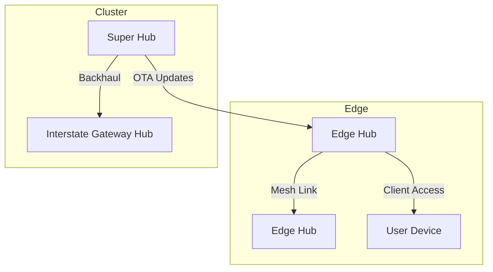

# Aku Platform Documentation

## Executive Summary

Aku Platform is a community-owned, decentralized education and telecom infrastructure for Africa. It integrates AI-powered learning, resilient hardware, and mesh networking to deliver accessible, personalized, and verifiable education and connectivity to underserved communities. Aku leverages edge computing, solar/wind energy, and blockchain (Aku Coin) for compensation and transparent ownership.

## Overview

Aku Platform is a smart, modular classroom and telecom solution for teachers, students, and communities, integrating AI, collaboration, analytics, and hardware monitoring.

## Microservices

- **AI Tutor:** Real-time Q&A, hints, explanations
- **Polls/Q&A:** Live polls, quizzes, and feedback
- **Hub Integration:** Sync lessons, quizzes, resources
- **Analytics:** Progress tracking, engagement, reports
- **Classroom Management:** Attendance, device control
- **Accessibility:** TTS, multi-language, UI options
- **Hardware Integration:** Sensors, energy management
- **Marketplace:** Item listing, buying, and Aku Coin transactions
- **Community:** Compensation logic and member data

## Frontend

- Vue dashboard for real-time status, analytics, and collaboration
- Touch-friendly, large-format UI for smart boards/TVs
- Marketplace & Community dashboards for item transactions and compensation tracking

## Deployment

- See `DEPLOYMENT.md` for build, run, and update instructions
- Use CI/CD workflows for automated testing and deployment
- Monitoring dashboards expanded for CPU, memory, SQL, and pod restarts
- Automated alerting for infra incidents (email notifications)

## Troubleshooting

- Check logs for errors in backend and frontend
- Use maintenance checklist for hardware issues

## Training

- See guides for teachers/admins on using dashboard, uploading content, and managing devices

## Aku Network: Community-Owned Decentralized Telecom Infrastructure

## Strategic Vision

Aku Platform leverages decentralized edge computing (Aku Hubs/mini data centers) to build a competitive, community-focused telecommunications network. This model creates a Community-Owned, Decentralized Telecommunications Infrastructure, differentiating us from legacy providers (MTN, Airtel) by prioritizing local processing, peer-to-peer data exchange, and community ownership.

## Phased Rollout Strategy

### Phase 1: Technological Foundation (Decentralized Mesh Network)

- Transition from Hub-and-Spoke to True Mesh Network across regions.
- Upgrade Aku Hubs to Mesh Nodes with long-range radios (Wi-Fi/LoRa).
- Integrate Mobile-Edge-Computing (MEC) for local voice/video/data routing and caching.
- Develop Aku Embedded SIM (eSIM) OS layer for device auto-connect and bandwidth sharing.
- Utilize solar/wind-equipped public infrastructure for continuous coverage.

### Phase 2: Community & Economic Model

- Launch "Aku Node Partner" program: Incentivize hosting/powering Hubs with Aku Coin, free/subsidized access, and micro-payments.
- Prioritize local/state traffic for ultra-low latency and cost efficiency.
- Implement Aku Coin for partner compensation and transparent, decentralized ownership.

### Phase 3: State Rollout Strategy

- Pilot in a single LGA, then expand in rings to maximize coverage and efficiency.
- Establish state backbone with minimal global backhaul.

## Mesh Network Architecture Diagram

## Edge Hub Hardware Blueprint

- Solar Panel (Top)
- Wind Turbine (Optional)
- Dual Antennae (LoRa/Mesh, Wi-Fi)
- IP67 Enclosure
- Power Management PCB
- Jetson Orin Nano / RPi CM4
- eMMC/SSD Storage
- LiFePO4 Battery
- Battery Management System
- Passive Heatsink
- Mounting Brackets

---

## Recent Changes Reflected

- Hybrid solar/wind energy harvesting and multi-product hardware integration
- Updated sensor code and backend endpoints for wind energy
- CI/CD workflows modernized and fixed
- Documentation, deployment, and troubleshooting guides expanded
- Community compensation logic and Aku Coin integration

---

For more details, see:

- `ARCHITECTURE.md` for network and hardware architecture
- `DEPLOYMENT.md` for deployment steps
- `hardware_integration/integration_guide.md` for hardware setup
- `docs/system_design.md` for system design and offline/online sync
- `docs/core_concepts.md` for mission, vision, and hybrid learning model
- `docs/tech_stack.md` for technology stack
- `docs/api_specs.md`, `docs/adrs.md`, `docs/functional_spec.md`, `docs/architecture.md` for technical specs and decisions
