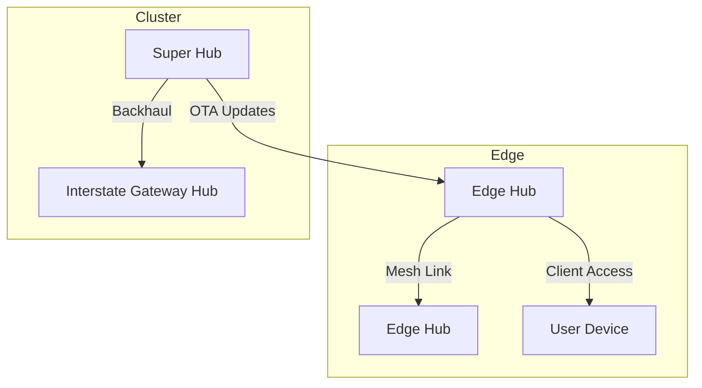

# Akulearn Documentation Repository

Welcome to the Akulearn documentation repository! This space contains all official documentation for the Akulearn EdTech platform, designed to empower learners and educators across Nigeria and Africa.

## Project Overview

Akulearn is an innovative EdTech initiative with a mission to make quality, personalized, and verifiable education universally accessible. Our hybrid learning ecosystem leverages technology—including AI, blockchain, and solar-powered hardware—to deliver engaging, curriculum-aligned content to both connected and underserved communities.

## What's Inside

This repository is organized for clarity and ease of navigation:

- **docs/00-project-overview/**: Vision, mission, and Phase 1 roadmap
- **docs/01-architecture/**: System architecture, ADRs, and design documents
- **docs/02-backend/**: Backend handbook, API specs, and database schemas
- **docs/03-mobile/**: Mobile app guidelines
- **docs/04-iot-projector/**: IoT projector guidelines
- **docs/05-cross-cutting/**: Technical specs and coding standards
- **docs/06-process-methodology/**: Agile/DevOps methodology
- **docs/07-glossary/**: Glossary of Akulearn terms
- **docs/images/**: Diagrams and screenshots

## How to Contribute

We welcome contributions! Please check back soon for our contribution guidelines and process.

## How to View Documentation

To view the documentation locally:

1. Install [MkDocs](https://www.mkdocs.org/) and the [Material for MkDocs](https://squidfunk.github.io/mkdocs-material/) theme.

2. In your terminal, run:

   ```sh
   pip install mkdocs mkdocs-material
   mkdocs serve
   ```

3. Open [http://localhost:8000](http://localhost:8000) in your browser to explore the docs.

## Contact Information

For questions, feedback, or partnership inquiries, please contact the Akulearn team (details coming soon).

---

Thank you for helping us build a brighter future for education!

# Aku Platform Documentation Repository

Welcome to the Aku Platform documentation repository! This space contains all official documentation for the Aku Platform, designed to empower learners and communities across Africa.

## Architecture Overview

Below is the Aku Platform architecture diagram. If you see a rendering error, please view the diagram in a Markdown editor that supports Mermaid, or see the GitHub documentation for troubleshooting.



> **Note:** If the diagram does not render, see [GitHub Mermaid Diagrams](https://docs.github.com/get-started/writing-on-github/working-with-advanced-formatting/creating-diagrams#creating-mermaid-diagrams) for troubleshooting.

## Project Overview

Aku Platform is an innovative initiative with a mission to make quality, personalized, and verifiable education and connectivity universally accessible. Our hybrid ecosystem leverages AI, blockchain, and solar/wind-powered hardware to deliver engaging, curriculum-aligned content and telecom services to both connected and underserved communities.

## Repository Structure

- **docs/00-project-overview/**: Vision, mission, and Phase 1 roadmap
- **docs/01-architecture/**: System architecture, ADRs, and design documents
- **docs/02-backend/**: Backend handbook, API specs, and database schemas
- **docs/03-mobile/**: Mobile app guidelines
- **docs/04-iot-projector/**: IoT projector guidelines
- **docs/05-cross-cutting/**: Technical specs and coding standards
- **docs/06-process-methodology/**: Agile/DevOps methodology
- **docs/07-glossary/**: Glossary of Aku terms
- **docs/images/**: Diagrams and screenshots

## How to Contribute

We welcome contributions! Please check back soon for our contribution guidelines and process.

## How to View Documentation

To view the documentation locally:

1. Install [MkDocs](https://www.mkdocs.org/) and the [Material for MkDocs](https://squidfunk.github.io/mkdocs-material/) theme.
2. In your terminal, run:
   ```sh
   pip install mkdocs mkdocs-material
   mkdocs serve
   ```
3. Open [http://localhost:8000](http://localhost:8000) in your browser to explore the docs.

## Contact Information

For questions, feedback, or partnership inquiries, please contact the Aku Platform team (details coming soon).

---

Thank you for helping us build a brighter future for education and connectivity!
