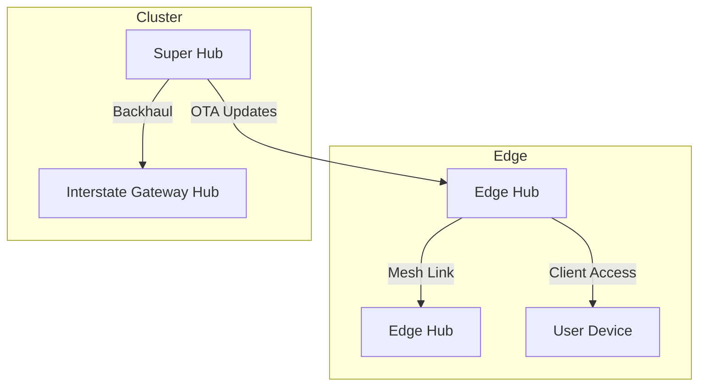

# Akulearn Documentation Repository


Welcome to the Akulearn documentation repository! This space contains all official documentation for the Akulearn EdTech platform, designed to empower learners and educators across Nigeria and Africa.

## Key Platform Decisions

| Decision | Choice |
|----------|--------|
| **Backend language** | Python 3.11 / FastAPI (all services) |
| **Frontend / Dashboard** | `akulearn-dashboard/` in this monorepo (Next.js 14) — canonical Vercel deployment |
| **Mobile** | Kotlin Multiplatform — migrating to `oumar-code/Aku-Mobile` |
| **Documentation** | This repo (`Akulearn_docs`) — MkDocs site on GitHub Pages |

## Ecosystem Repository Map

> Full details: [`docs/ecosystem-map.md`](docs/ecosystem-map.md)

### Backend Services (Python / FastAPI)

| Repo | Role |
|------|------|
| [Aku-EdgeHub](https://github.com/oumar-code/Aku-EdgeHub) | Tier 1 — Offline edge server, local AI inference, device sync |
| [Aku-SuperHub](https://github.com/oumar-code/Aku-SuperHub) | Tier 2 — Regional analytics, fleet management |
| [Aku-IGHub](https://github.com/oumar-code/Aku-IGHub) | Tier 3 — Global gateway, Aku Coin clearing, credential registry |
| [Akudemy](https://github.com/oumar-code/Akudemy) | Aku Learn — content delivery, offline sync, blockchain credentials |
| [AkuAI](https://github.com/oumar-code/AkuAI) | Shared AI/ML inference layer (text-gen, classify, Gemma) |
| [AkuTutor](https://github.com/oumar-code/AkuTutor) | AI Tutor — curriculum Q&A, feedback loops |
| [AkuWorkspace](https://github.com/oumar-code/AkuWorkspace) | AI-Native Productivity Suite |
| [Aku-DaaS](https://github.com/oumar-code/Aku-DaaS) | Data governance — anonymised datasets, IG-Hub publishing |
| [Aku-Telhone](https://github.com/oumar-code/Aku-Telhone) | eSIM provisioning — OTA SIM lifecycle, MVNO (Telhone brand) |

### Frontend (canonical: this monorepo)

| Location | Role |
|----------|------|
| `akulearn-dashboard/` | Marketing site + all dashboard pages — Vercel deployed |

## Project Overview

Akulearn is an innovative EdTech initiative with a mission to make quality, personalized, and verifiable education universally accessible. Our hybrid learning ecosystem leverages technology—including AI, blockchain, and solar-powered hardware—to deliver engaging, curriculum-aligned content to both connected and underserved communities.

## What's Inside

This repository is organized for clarity and ease of navigation:

- **docs/ecosystem-map.md**: Master map of all repos, roles, and status
- **docs/service-templates/**: Python/FastAPI bootstrap guide for all service repos
- **docs/00-project-overview/**: Vision, mission, and Phase 1 roadmap
- **docs/01-architecture/**: System architecture, ADRs, and design documents
- **docs/02-backend/**: Backend handbook, API specs, and database schemas
- **docs/03-mobile/**: Mobile app guidelines
- **docs/04-iot-projector/**: IoT projector guidelines
- **docs/05-cross-cutting/**: Technical specs and coding standards
- **docs/06-process-methodology/**: Agile/DevOps methodology
- **docs/07-glossary/**: Glossary of Akulearn terms
- **docs/images/**: Diagrams and screenshots
- **akulearn-dashboard/**: Canonical Next.js frontend (source of truth)
- **KOTLIN MULTIPLATFORM/**: KMP shared library (migrating to `oumar-code/Aku-Mobile`)

### Strategic Roadmap & Thought Leadership
- **docs/clean_energy_for_africa.md**: Clean energy research and vision for Africa
- **docs/clean_energy_whitepaper.md**: Whitepaper on clean energy and digital transformation
- **docs/ai_automation_industry4.md**: AI, automation, and Industry 4.0 for Africa
- **docs/aku_change_maker.md**: Aku’s role as a change maker and ecosystem builder

## How to Contribute

We welcome contributions! Please check back soon for our contribution guidelines and process.


## Deployment & Automation

CI/CD, linting, and documentation builds are automated via [GitHub Actions](.github/workflows/automation.yml) and [docs-deploy.yml](.github/workflows/docs-deploy.yml).

### Automation Steps
- Linting (ESLint, placeholder for docs)
- Docs build (MkDocs)
- Docs deployment (GitHub Pages)
- Mermaid diagram rendering (render-mermaid.yml)
- Progress tracked in automation_progress.md

## How to View Documentation

To view the documentation locally:

1. Install [MkDocs](https://www.mkdocs.org/) and the [Material for MkDocs](https://squidfunk.github.io/mkdocs-material/) theme.

2. In your terminal, run:

   ```sh
   pip install mkdocs mkdocs-material
   mkdocs serve
   ```

3. Open [http://localhost:8000](http://localhost:8000) in your browser to explore the docs.

## Team Setup & Supabase Provisioning

Both `team.py` and `supabase_provision.py` live at the **project root** and must be run from there.

### 1. View team dashboards (`team.py`)

```sh
# From the project root directory (e.g. Akulearn_docs/)
python team.py
```

Prints every team member's name, role, dashboard key, and the full list of platform accesses they have.

### 2. Provision team members in Supabase (`supabase_provision.py`)

**Prerequisites** — copy `.env.example` to `.env` and fill in your values:

```sh
cp .env.example .env
# then edit .env and set:
#   SUPABASE_URL              = https://your-project-ref.supabase.co
#   SUPABASE_SERVICE_ROLE_KEY = <service_role key from Supabase Dashboard → Project Settings → API>
#   RESEND_API_KEY            = <optional — only needed to email credentials>
```

**Run the provisioning script:**

```sh
# From the project root directory (e.g. Akulearn_docs/)
python supabase_provision.py
```

- If `SUPABASE_URL` / `SUPABASE_SERVICE_ROLE_KEY` are not set, the script runs in **dry-run mode** — it prints the team roster with sample credentials but does **not** create any accounts.
- When the credentials are present, the script creates each team member's account in Supabase with the correct role and dashboard assigned.
- If `RESEND_API_KEY` is also set, each newly created user receives a welcome email with their temporary password.

> ⚠ Never commit your `.env` file. It is already listed in `.gitignore`.

## Contact Information

For questions, feedback, or partnership inquiries, please contact the Akulearn team (details coming soon).



```mermaid
graph TD
    subgraph Edge
        E1[Edge Hub] -- Mesh Link --> E2[Edge Hub]
        E1 -- Client Access --> D1[User Device]
    end
    subgraph Cluster
        C1[Super Hub] -- Backhaul --> IG1[IG-Hub]
        C1 -- OTA Updates --> E1
    end
    IG1[Interstate Gateway Hub]
```

## Repository Structure

| Directory | Purpose |
|---|---|
| `KOTLIN MULTIPLATFORM/` | Android + iOS mobile app (KMP) |
| `docs/` | Platform documentation (MkDocs) |
| `supabase/` | Auth and database schema |
| `infra/` / `kubernetes/` | Infrastructure and deployment |
| `wave3_rest_api.py` and related | Python content and recommendation backend |

Full documentation structure:

- **`docs/00-project-overview/`** — Vision, mission, and Phase 1 roadmap
- **`docs/01-architecture/`** — System architecture and design documents
- **`docs/02-backend/`** — Backend handbook, API specs, and database schemas
- **`docs/03-mobile/`** — Mobile app guidelines
- **`docs/04-iot-projector/`** — IoT projector guidelines
- **`docs/05-cross-cutting/`** — Technical specs and coding standards
- **`docs/06-process-methodology/`** — Agile/DevOps methodology
- **`docs/07-glossary/`** — Glossary of Aku terms
- **`docs/images/`** — Diagrams and screenshots

## Getting Started

### Mobile App (Android / iOS)
See [`KOTLIN MULTIPLATFORM/README.md`](KOTLIN%20MULTIPLATFORM/README.md) for full setup instructions.

### Documentation Site
```sh
pip install mkdocs mkdocs-material
mkdocs serve
```
Open [http://localhost:8000](http://localhost:8000) in your browser.

### Python Backend
```sh
pip install -r requirements.txt
python start_wave3_server.py
```

## Contributing

Please read [CONTRIBUTING.md](CONTRIBUTING.md) before submitting pull requests or opening issues.

## Contact

For questions, feedback, or partnership inquiries, please contact the Aku Platform team (details coming soon).

---

Thank you for helping us build a brighter future for education and connectivity!

# Aku Platform Documentation Repository

Welcome to the Aku Platform documentation repository! This space contains all official documentation for the Aku Platform, designed to empower learners and communities across Africa.

## Interactive Zamfara Network Map

[](https://oumar-code.github.io/Akulearn_docs/docs/network-map/)

> **Click the image above or [this link](https://oumar-code.github.io/Akulearn_docs/docs/network-map/) to view the interactive Zamfara mesh network map.**

## Architecture Overview

Below is the Aku Platform architecture diagram. If you see a rendering error, please view the diagram in a Markdown editor that supports Mermaid, or see the GitHub documentation for troubleshooting.


```mermaid
graph TD
    subgraph Edge
        E1[Edge Hub] -- Mesh Link --> E2[Edge Hub]
        E1 -- Client Access --> D1[User Device]
    end
    subgraph Cluster
        C1[Super Hub] -- Backhaul --> IG1[IG-Hub]
        C1 -- OTA Updates --> E1
    end
    IG1[Interstate Gateway Hub]
```

> **Note:** If the diagram does not render, see [GitHub Mermaid Diagrams](https://docs.github.com/get-started/writing-on-github/working-with-advanced-formatting/creating-diagrams#creating-mermaid-diagrams) for troubleshooting.

## Project Overview

Aku Platform is an innovative initiative with a mission to make quality, personalized, and verifiable education and connectivity universally accessible. Our hybrid ecosystem leverages AI, blockchain, and solar/wind-powered hardware to deliver engaging, curriculum-aligned content and telecom services to both connected and underserved communities.

## Repository Structure

- **docs/00-project-overview/**: Vision, mission, and Phase 1 roadmap
- **docs/01-architecture/**: System architecture, ADRs, and design documents
- **docs/02-backend/**: Backend handbook, API specs, and database schemas
- **docs/03-mobile/**: Mobile app guidelines
- **docs/04-iot-projector/**: IoT projector guidelines
- **docs/05-cross-cutting/**: Technical specs and coding standards
- **docs/06-process-methodology/**: Agile/DevOps methodology
- **docs/07-glossary/**: Glossary of Aku terms
- **docs/images/**: Diagrams and screenshots

## How to Contribute

We welcome contributions! Please check back soon for our contribution guidelines and process.

## How to View Documentation

To view the documentation locally:

1. Install [MkDocs](https://www.mkdocs.org/) and the [Material for MkDocs](https://squidfunk.github.io/mkdocs-material/) theme.
2. In your terminal, run:
   ```sh
   pip install mkdocs mkdocs-material
   mkdocs serve
   ```
3. Open [http://localhost:8000](http://localhost:8000) in your browser to explore the docs.

## Contact Information

For questions, feedback, or partnership inquiries, please contact the Aku Platform team (details coming soon).

---

Thank you for helping us build a brighter future for education and connectivity!
"# Akudemy" 
