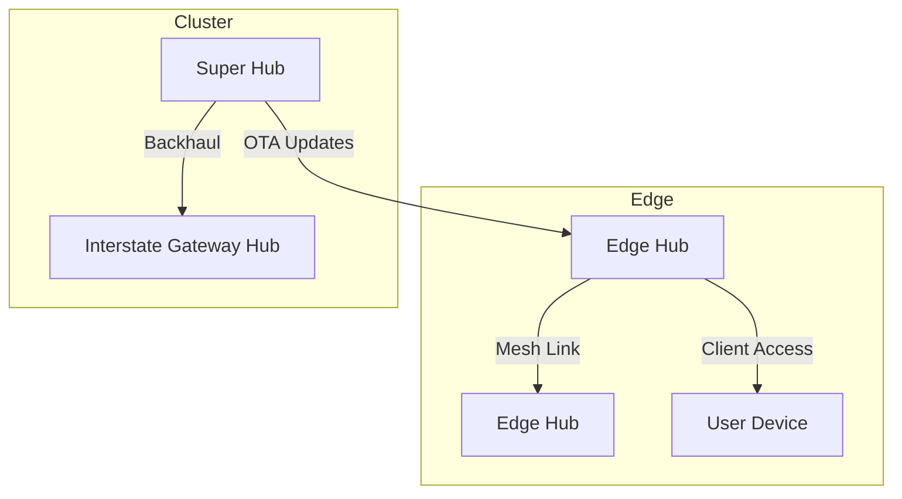

# Mesh Network Architecture Diagram

```mermaid
graph TD
    subgraph Edge
        E1[Edge Hub] -- Mesh Link --> E2[Edge Hub]
        E1 -- Client Access --> D1[User Device]
    end
    subgraph Cluster
        C1[Super Hub] -- Backhaul --> IG1[IG-Hub]
        C1 -- OTA Updates --> E1
    end
    IG1[Interstate Gateway Hub]
```
