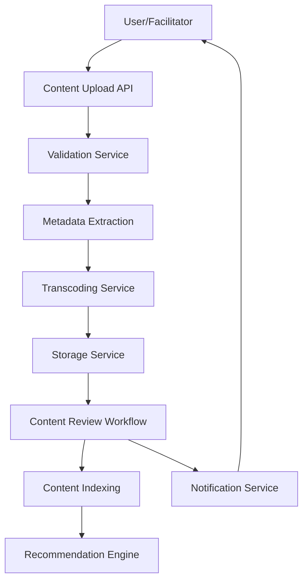
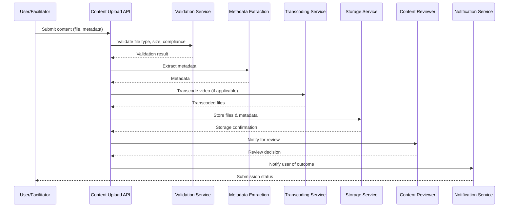

# Content Ingestion Pipeline: High-Level & Low-Level Design

## High-Level Design (HLD)

The Akulearn Content Ingestion Pipeline enables secure, scalable, and efficient onboarding of user-generated educational content (videos, documents, quizzes) from facilitators and content creators. The pipeline ensures content validation, metadata extraction, storage, and availability for learners across both online and offline modalities.

### Key Components

- **Content Upload API:** Receives content submissions from authenticated users.
- **Validation Service:** Checks file types, sizes, and basic compliance (e.g., copyright, format).
- **Metadata Extraction Service:** Extracts key metadata (title, subject, grade, tags, duration).
- **Transcoding Service:** Converts videos to multiple resolutions/formats for compatibility and bandwidth optimization.
- **Storage Service:** Stores content in object storage (IPFS/Filecoin for large files, MongoDB for metadata).
- **Content Review Workflow:** Facilitator/SME review and approval before publishing.
- **Notification Service:** Alerts users on submission status and review outcomes.
- **Content Indexing:** Updates search indexes and recommendation engine.

### HLD Diagram (Mermaid)



---

## Low-Level Design (LLD)

### Sequence Diagram (Mermaid)



### Pseudo-Code: Content Ingestion API

```python
# Pseudo-code for content upload endpoint

def upload_content(user, file, metadata):
    if not validate_user(user):
        return error('Unauthorized')
    if not validate_file(file):
        return error('Invalid file')
    extracted = extract_metadata(file, metadata)
    if file.type == 'video':
        transcoded = transcode_video(file)
    else:
        transcoded = file
    storage_id = store_content(transcoded, extracted)
    review_id = notify_reviewer(storage_id)
    return success('Content submitted for review', review_id)
```

---

## Design Highlights

- Modular microservices for each pipeline stage
- Asynchronous processing for scalability
- Secure authentication and validation at every step
- Extensible for future content types and review workflows
- Integrated with recommendation and search systems

For further details, see the ADRs and backend documentation.
