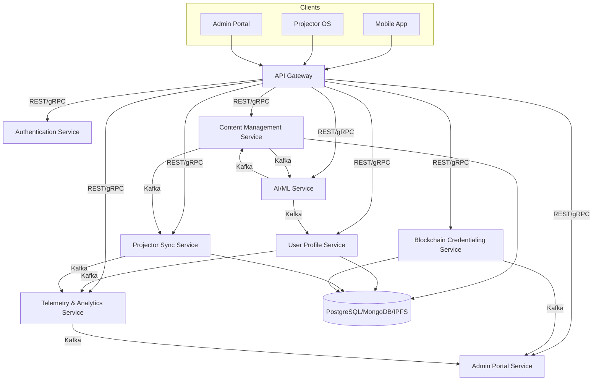

# Akulearn Architecture Overview

## System Design Summary

Akulearn is built on a scalable, modular microservices architecture designed to support a hybrid learning ecosystem for both connected and underserved communities. The platform leverages cloud-native technologies, containerization, and event-driven communication to ensure reliability, flexibility, and rapid feature delivery.

## Key Microservices & Components

- **API Gateway:** Central entry point for all client requests, handling routing, authentication, and rate limiting.
- **Authentication Service:** Manages user registration, login, JWT issuance, and role-based access control (RBAC).
- **Content Management Service (CMS):** Handles ingestion, storage, and delivery of curriculum-aligned educational content.
- **User Profile Service:** Stores and manages learner, facilitator, and parent profiles, including progress tracking.
- **AI/ML Service:** Provides adaptive learning recommendations, personalized quizzes, and powers the AI Tutor.
- **Projector Sync Service:** Facilitates data synchronization between offline projector units and the central platform.
- **Blockchain Credentialing Service:** Issues and verifies tamper-proof digital certificates and manages content ownership via smart contracts.
- **Admin Portal Service:** Supports user management, content uploads, analytics, and projector registration for administrators.
- **Telemetry & Analytics Service:** Collects usage data, monitors device health, and generates reports for stakeholders.

## Primary Interactions

- Clients (Mobile App, Projector OS, Admin Portal) interact with the platform via the API Gateway.
- Microservices communicate asynchronously using Kafka (event bus) for scalability and decoupling, and synchronously via REST/gRPC for real-time operations.
- Data is stored in PostgreSQL (relational), MongoDB (NoSQL), and IPFS/Filecoin (decentralized storage for large content).
- AI/ML and Blockchain services are integrated for personalized learning and verifiable credentials.

## High-Level Architecture Diagram (Mermaid)

## Architectural Highlights

- **Scalability:** Microservices can be independently deployed and scaled based on demand.
- **Resilience:** Event-driven architecture (Kafka) ensures robust communication and fault tolerance.
- **Security:** Centralized authentication, RBAC, and encrypted communication (HTTPS) across all services.
- **Extensibility:** Modular design allows for easy integration of new features (e.g., E-Library, Higher Ed modules).
- **Observability:** Comprehensive logging, monitoring, and analytics for proactive system management.

---

For more details, see the ADRs and HLD/LLD documents in this section.
