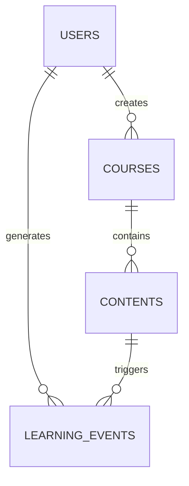

# Akulearn Database Schemas & ERDs

## Relational Database (PostgreSQL)

### User Management Schema

```sql
CREATE TABLE users (
    id UUID PRIMARY KEY,
    email VARCHAR(255) UNIQUE NOT NULL,
    password_hash VARCHAR(255) NOT NULL,
    role VARCHAR(50) NOT NULL,
    created_at TIMESTAMP NOT NULL DEFAULT NOW(),
    updated_at TIMESTAMP
);
```

### Course/Content Schema

```sql
CREATE TABLE courses (
    id UUID PRIMARY KEY,
    title VARCHAR(255) NOT NULL,
    subject VARCHAR(100) NOT NULL,
    grade VARCHAR(50),
    created_by UUID REFERENCES users(id),
    created_at TIMESTAMP NOT NULL DEFAULT NOW()
);

CREATE TABLE contents (
    id UUID PRIMARY KEY,
    course_id UUID REFERENCES courses(id),
    type VARCHAR(50) NOT NULL, -- e.g., video, document, quiz
    url TEXT NOT NULL,
    metadata JSONB,
    created_at TIMESTAMP NOT NULL DEFAULT NOW()
);
```

### Learning Analytics Schema

```sql
CREATE TABLE learning_events (
    id UUID PRIMARY KEY,
    user_id UUID REFERENCES users(id),
    content_id UUID REFERENCES contents(id),
    event_type VARCHAR(50) NOT NULL, -- e.g., view, complete, quiz_attempt
    event_data JSONB,
    timestamp TIMESTAMP NOT NULL DEFAULT NOW()
);
```

## ERD (Entity Relationship Diagram)



---

## NoSQL Database (MongoDB)

### Content Metadata Schema

```json
{
  "_id": "ObjectId",
  "course_id": "UUID",
  "type": "string", // video, document, quiz
  "title": "string",
  "subject": "string",
  "grade": "string",
  "tags": ["string"],
  "duration": "number", // in seconds
  "author": {
    "id": "UUID",
    "name": "string"
  },
  "upload_date": "ISODate",
  "review_status": "string", // pending, approved, rejected
  "metadata": {
    // additional flexible fields
  }
}
```

---

For further details, see the backend handbook and ADRs.
