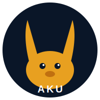

# Welcome to Akulearn Documentation

Welcome to the Akulearn documentation repository! This space contains all official documentation for the Akulearn EdTech platform, designed to empower learners and educators across Nigeria and Africa.

## Project Overview

Akulearn is an innovative EdTech initiative with a mission to make quality, personalized, and verifiable education universally accessible. Our hybrid learning ecosystem leverages technology—including AI, blockchain, and solar-powered hardware—to deliver engaging, curriculum-aligned content to both connected and underserved communities.

## Brand Identity

The Aku Platform ecosystem uses the following brand marks:

| Brand | Logo | Service |
|-------|------|---------|
| **Aku Platform (primary)** | `docs/images/logos/aku-brand-horns-up.svg` | Platform-wide, IG-Hub, marketing |
| **Aku Platform (alternate)** | `docs/images/logos/aku-brand-horns-down.svg` | Edge Hub community, print |
| **Akudemy** | `docs/images/logos/akudemy-logo.svg` | Aku Learn — education delivery |
| **Telhone** | `docs/images/logos/telhone-logo.svg` | Aku eSIM — telecom & SIM provisioning |

See [`docs/images/logos/README.md`](images/logos/README.md) for full usage guidelines.

## Documentation Structure

This documentation is organized for clarity and ease of navigation:

- **Project Overview**: Vision, mission, and Phase 1 roadmap
- **Architecture**: System architecture, ADRs, and design documents
- **Backend**: Backend handbook, API specs, and database schemas
- **Mobile App**: Mobile app guidelines
- **IoT Projector**: IoT projector guidelines
- **Cross-Cutting**: Technical specs, coding standards, and containerisation guide
- **Process & Methodology**: Agile/DevOps methodology
- **Glossary**: Glossary of Akulearn terms

## Getting Started

Explore the navigation menu to learn more about the Akulearn platform, its architecture, and development guidelines.

## Contact Information

For questions, feedback, or partnership inquiries, please contact the Akulearn team.

---

Thank you for helping us build a brighter future for education!
