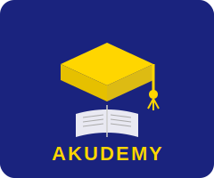

<!--
COPILOT_PROMPT:
Generate Aku Learn service doc: local caching on Edge Hubs, offline-first curricula sync, teacher/admin tools, metrics.
-->
# Aku Learn



> **Aku Learn** is the education delivery service of the Aku Platform, branded as **Akudemy** in student- and community-facing contexts.

## Overview

Aku Learn delivers curriculum-aligned educational content to learners in both connected and offline environments. It leverages local caching on Aku Edge Hubs for offline-first operation, adaptive AI for personalised learning paths, and the Akudemy brand identity for all student-facing touchpoints.

## Brand Identity

The **Akudemy** brand (logo: `docs/images/logos/akudemy-logo.svg`) is used across:
- Student mobile app screens and splash pages
- School and educator portal headers
- Community projector-based learning session materials
- Printed certificates and achievement badges

## Core Features

- **Offline-First Curricula Sync:** Content is pre-cached on Aku Edge Hubs so learners can access lessons without internet connectivity. Sync is triggered whenever the Edge Hub regains connectivity to a Super Hub.
- **Adaptive Learning Paths:** The AI/ML Service analyses learner performance and adjusts the sequence and difficulty of content in real time.
- **AI Tutor:** An integrated AI tutor (powered by the AI/ML Service) answers questions, provides hints, and gives instant feedback.
- **Teacher & Admin Tools:** Dashboard for teachers to track class progress, assign content, and communicate with guardians; admin tools for school-level reporting.
- **Blockchain Credentials:** On course completion, verifiable certificates are issued via the Blockchain Credentialing Service.

## Architecture Integration

```
Learner Device / Projector
        |
   Aku Edge Hub (local cache, AI inference, SIP proxy)
        |
   Aku Super Hub (regional analytics, content updates, model fine-tuning)
        |
   Aku IG-Hub (global content catalogue, credential registry, policy)
```

- Content is ingested by the **Content Management Service (CMS)** and propagated to Edge Hubs.
- Learner profiles and progress are managed by the **User Profile Service**.
- The **AI/ML Service** provides recommendations and tutoring responses.
- Certificates are issued by the **Blockchain Credentialing Service**.

## Containerisation

Aku Learn is deployed as a set of Docker containers orchestrated by Kubernetes. See [`docs/05-cross-cutting/containerization.md`](../05-cross-cutting/containerization.md) for the full containerisation guide.

Key containers:
| Container | Image | Purpose |
|-----------|-------|---------|
| `aku-learn-api` | `aku/learn-api:latest` | REST/gRPC API for content and learner data |
| `aku-learn-sync` | `aku/learn-sync:latest` | Offline content sync agent for Edge Hubs |
| `aku-learn-ai-tutor` | `aku/ai-tutor:latest` | AI tutor inference service |

## Observability & Metrics

- **Learning Engagement:** Daily/weekly active learners, lessons completed, quiz pass rates.
- **Sync Health:** Edge Hub sync success rate, content freshness (hours since last sync).
- **AI Tutor:** Response latency, user satisfaction scores, fallback rate (when local inference is unavailable).
- **Credential Issuance:** Certificates issued per period, blockchain confirmation time.

## Configuration

Key environment variables (set per-deployment):

| Variable | Description |
|----------|-------------|
| `CONTENT_SYNC_INTERVAL_HOURS` | How frequently Edge Hub syncs content from Super Hub |
| `AI_TUTOR_MODEL` | Model identifier for the local AI tutor |
| `BLOCKCHAIN_NETWORK` | Target Polygon network for credential issuance |
| `AKUDEMY_BRAND_LOGO_URL` | URL to the Akudemy SVG logo served by the platform CDN |
