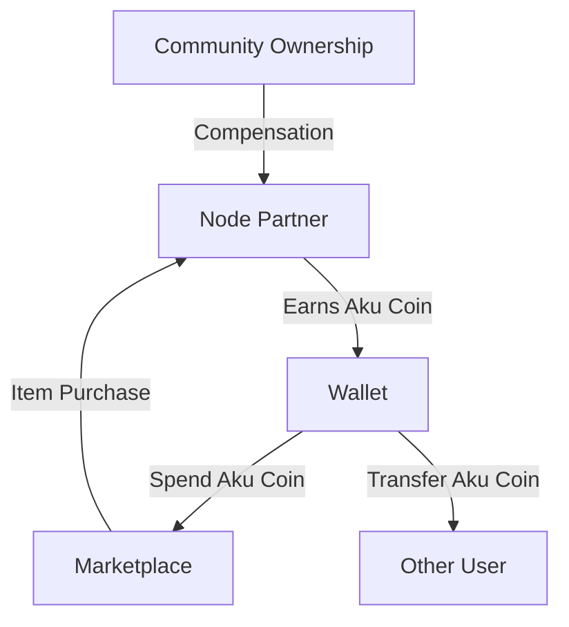

# Akulearn Technology Stack

## Aku Coin Model Diagram

## Blockchain Integration

All blockchain calls MUST use PolygonService for verified credentials and AkuCoin, as referenced in guardrails.

## Core Technologies

- Python (FastAPI, SQLAlchemy)
- React Native (Mobile)
- PostgreSQL
- Docker, Kubernetes
- AI/ML: NLP, GenAI

## Placeholder for further tech stack details
