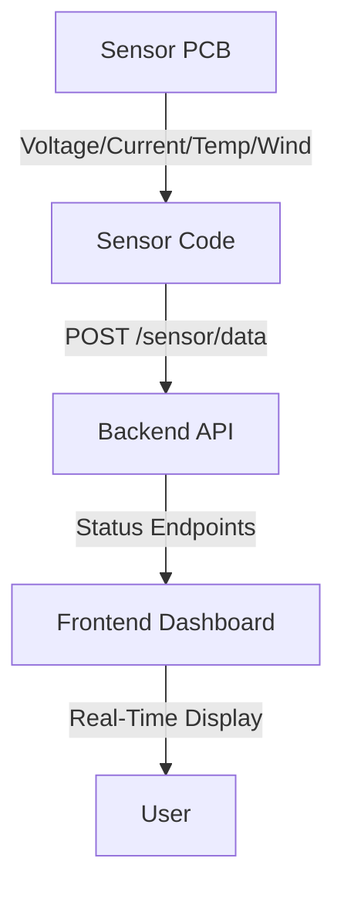

# Aku Platform Hardware Integration Guide

## 1. Hardware Block Diagram
See `akulearn_hardware_block_diagram.png` for a visual overview of the system:
- Solar Panel → Charge Controller → Battery → Inverter → Smart Board/TV/Projector Hub
- Wind Turbine → Charge Controller → Battery → Inverter → Smart Board/TV/Projector Hub
- Sensors (voltage, current, temperature, wind speed) connect to PCB, which interfaces with the backend via API.

## 2. Wiring & Assembly
- Follow the wiring diagram in `solar_power_wiring_diagram.md` and add wind turbine wiring as per manufacturer specs.
- Use fuses/breakers as specified for safety.
- Mount all hardware in the enclosure (`akulearn_enclosure_cad.step`).

## 3. Modular Sensor Code & Backend Connection
- The sensor code (`sensor_code.py`) is now modular and supports multiple product types (hub, projector, smart board, etc.).
- Install dependencies:
  ```sh
  pip install adafruit-circuitpython-ina219 adafruit-circuitpython-ds18x20 adafruit-circuitpython-onewire requests
  # For wind sensor (example): pip install adafruit-circuitpython-anemometer
  ```
- Connect sensors to PCB as per schematic (`akulearn_sensor_pcb.sch`).
- Run `sensor_code.py` with the appropriate product type to read sensors and POST data to backend (`/sensor/data`).
- Backend API now supports endpoints for sensor, solar, and wind status for all products.

### Sensor Data Flow Diagram



## 4. Backend API Setup
- Start FastAPI backend with endpoints for sensor, solar, and wind status.
- Example endpoints:
  - `/sensor/data` (POST): Receives sensor readings
  - `/pcb/status` (GET): Returns latest sensor status
  - `/solar/status` (GET): Returns solar system status
  - `/wind/status` (GET): Returns wind system status

## 5. Dashboard Integration
- Use `dashboard_hardware_status.vue` in your frontend to display real-time hardware data for all products.
- Fetch data from backend endpoints and show warnings for low battery, faults, or low wind/solar input.

## 6. Maintenance & Troubleshooting
- Follow `maintenance_checklist.pdf` for regular system checks.
- Use diagnostic scripts to test hardware and API connectivity.
- Refer to troubleshooting guides for common issues.

---

This guide ensures a consistent, safe, and maintainable integration of all Aku Platform hardware and software components, supporting hybrid solar/wind energy harvesting and multi-product hardware integration.
